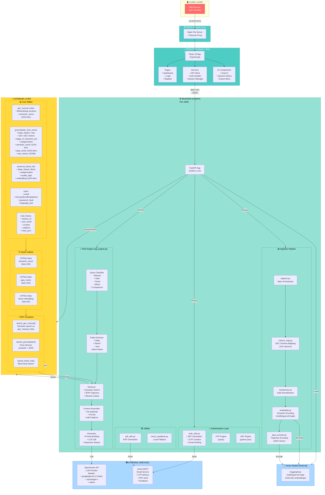

# INGRES Architecture - Complete Specification for Diagram Generation

## 📊 MERMAID DIAGRAM (Copy-Paste Ready)



---

## 📋 DETAILED COMPONENT SPECIFICATION (For Manual Diagram Tools)

### **LAYER 1: CLIENT**
- **Component**: Web Browser
- **Technology**: HTML5, JavaScript Engine
- **Port**: N/A
- **Connects To**: Nginx reverse proxy (HTTPS)
- **Function**: Displays UI, handles user interactions

---

### **LAYER 2: FRONTEND (Port 3000)**

#### **2A: React Application**
- **Name**: INGRES Frontend
- **Technology**: React 18 + TypeScript + Vite
- **Components**:
  - Pages (Dashboard, Login, Register, Verify OTP)
  - UI Components (Chat UI, Session History, Export)
  - Services (API client, session manager, auth handler)
- **Connects To**: 
  - nginx (serves static files)
  - FastAPI backend (REST API calls)
- **Key Files**:
  - `src/App.tsx` - Routing
  - `src/pages/Dashboard.tsx` - Main chat UI
  - `src/services/api.ts` - API client

#### **2B: nginx Reverse Proxy**
- **Name**: nginx Server
- **Technology**: nginx (Alpine)
- **Port**: 3000
- **Function**: 
  - Serves static React build
  - Proxies API calls to backend
- **Connects To**:
  - React app (static files)
  - FastAPI backend (API proxy)

---

### **LAYER 3: BACKEND (Port 8000)**

#### **3A: API Gateway**
- **Name**: FastAPI Application
- **Technology**: FastAPI (async Python web framework)
- **Port**: 8000
- **Entry Points**:
  - `/api/chat` - Chat endpoint
  - `/api/auth/*` - Authentication endpoints
  - `/api/chat/history` - Session retrieval
  - `/api/portal/dashboard-data` - Admin dashboard
- **Connects To**:
  - Frontend (REST API)
  - All backend subsystems

#### **3B: Authentication Layer**

**Components**:
- `auth_utils.py` - Token management
  - `create_jwt_token()` - Generate JWT
  - `verify_jwt_token()` - Validate JWT
  - `generate_otp()` - Create OTP
  - `send_otp_email()` - Email OTP

- `OTP Engine (pyotp)`
  - Time-based OTP (TOTP)
  - 6-digit codes
  - 10-minute validity

- `JWT Engine (python-jose)`
  - HS256 algorithm
  - User claims: {email, role, name}
  - Expiry: 30 days

**Flows**:
- Register → Send OTP → Verify → Issue JWT
- Login → Send OTP → Verify → Issue JWT
- All API calls → Verify JWT → Check role → Proceed

#### **3C: RAG Engine** (rag_engine.py)

**5-Step Process**:

1. **Query Classification**
   - Inputs: User query string
   - Outputs: QueryType enum
   - Types:
     - `MANUAL` - Methodology questions
     - `DATA_LOOKUP` - Point-in-time queries
     - `TREND_JEPA` - Temporal trend analysis
     - `BLOCK_RISK` - At-risk blocks
     - `COMPARISON` - Trends over time
     - `GENERAL` - Fallback

2. **Entity Extraction**
   - Extracts: state, district, year, block name
   - Uses: Pattern matching + NLP
   - Outputs: Entity dictionary

3. **Vector Retrieval** (DUAL STRATEGY!)
   - **Path A: Semantic Vector Search**
     - Query → embed to 1024-dim
     - Search: groundwater_time_series.semantic_vector
     - Index: IVFFlat (lists=150)
     - Return: top-10 rows with citations
   
   - **Path B: JEPA Trajectory Search**
     - Query → encode as trajectory intent
     - Search: groundwater_time_series.jepa_vector
     - Filter: jepa_trend_direction = "worsening*"
     - Index: IVFFlat (lists=150)
     - Return: trending districts

   - **Path C: Manual Lookup**
     - Search: gec_manual_index.embedding
     - Return: methodology sections

4. **Context Assembly**
   - De-duplicate results
   - Format with citations: `[Source: State, Year, Type]`
   - Add metadata (extraction stage, category)
   - Build prompt: `Context: [...] | Query: [...] | Answer:`

5. **Generation**
   - Call: OpenRouter API → Gemini 2.5 Flash
   - System prompt: Enforce citations
   - Temperature: 0.3 (factual)
   - Stream: Tokens → Server-Sent Events → Frontend
   - Save: chat_history table

**Key Files**:
- `project/backend/rag_engine.py` (1000+ lines)

#### **3D: Data Ingestion Pipeline**

**Orchestrator**: `ingestor.py`

**Step 1: Load Data** (`ingestor.py`)
- Load 9 data sources:
  - Attribute Tables (5 years)
  - Central Reports (all states, 153 cols)
  - State Reports (36 states, block-level)
  - Annexure-4A (at-risk blocks)
  - Annexure-4B (quality contamination)
  - GEC Manual (methodology)

**Step 2: Map Columns** (`column_map.py`)
- Maps 153-column GEC schema to canonical names
- Example: "Stage of GW Extraction (%)" → "stage_of_extraction_pct"
- Preserves unmapped → `raw_metrics` JSONB

**Step 3: Transform Data** (`transformer.py`)
- Normalize values
- Handle missing data
- Convert types
- Flatten nested structures

**Step 4: Semantic Encoding** (`embedder.py`)
- Build narrative: "In Nalgonda 2022, Stage=87.2%, Semi-Critical..."
- Encode with: multilingual-e5-large
- Output: 1024-dim `semantic_vector`
- Download model from HuggingFace

**Step 5: JEPA Encoding** (`jepa_encoder.py`)
- Input: 5-year time series of metrics
- Extract: velocity, acceleration, state, moments
- Compute: 80-dim feature vector
- Project: 80-dim → 1024-dim (fixed seed matrix)
- Output: `jepa_vector`

**Step 6: Batch Insert**
- Insert to groundwater_time_series
- Insert to annexure_block_risk
- Insert to gec_manual_index
- Create indices

#### **3E: Utilities**

- `pdf_utils.py` - PDF generation
  - Converts chat to PDF
  - Sends via email
  
- `mock_supabase.py` - Local fallback
  - Development mode
  - No internet connection

---

### **LAYER 4: VECTOR MODELS (External)**

#### **HuggingFace API**
- **Model**: `intfloat/multilingual-e5-large`
- **Dimensions**: 1024
- **Capabilities**: EN, HI, TE languages
- **Used For**: 
  - Semantic vector encoding
  - Query embedding
  - Manual section embedding
- **Access**: Downloaded locally or via HuggingFace API

---

### **LAYER 5: DATABASE (Supabase PostgreSQL 15 + pgvector)**

#### **5A: Core Tables**

**Table 1: gec_manual_index**
```
id: UUID Primary Key
source_file: TEXT (e.g., 'GEC_UserManual.pdf')
section_title: TEXT (e.g., 'Stage of Ground Water Extraction')
section_number: TEXT (e.g., '2.5')
page_number: INT
chunk_index: INT
content: TEXT (≤512 tokens)
content_hindi: TEXT (optional)
content_telugu: TEXT (optional)
embedding: VECTOR(1024)      ← Semantic vector
metadata: JSONB {keywords, formula, category}
created_at: TIMESTAMPTZ
Index: IVFFlat (lists=50)
```

**Table 2: groundwater_time_series** (THE MAIN TABLE)
```
id: UUID Primary Key
state: TEXT NOT NULL
district: TEXT NOT NULL
assessment_unit: TEXT (block/mandal)
assessment_year: INT NOT NULL
data_source: TEXT (central/state/XX)

-- Area metrics
geographical_area_ha: FLOAT
recharge_worthy_area_ha: FLOAT

-- Recharge columns (20+ variants)
total_annual_gw_recharge: FLOAT
natural_discharges: FLOAT

-- THE KEY DENOMINATOR
aegr: FLOAT

-- Extraction columns (15+ variants)
total_extraction: FLOAT

-- Output
stage_of_extraction_pct: FLOAT NOT NULL
categorization: TEXT (Safe/Semi-Critical/Critical/Over-Exploited)

-- Quality
quality_fluoride: BOOLEAN
quality_arsenic: BOOLEAN
quality_saline: BOOLEAN

-- VECTOR COLUMNS (THE INTELLIGENCE!)
semantic_vector: VECTOR(1024)  ← What's the status?
jepa_vector: VECTOR(1024)      ← What's the trend?

-- JEPA metadata
jepa_trend_direction: TEXT (worsening/improving/stable)
jepa_stage_velocity: FLOAT (% change per year)
jepa_years_in_sequence: INT[]
jepa_computed_at: TIMESTAMPTZ

-- Other
raw_metrics: JSONB {all 153 unmapped columns}
metadata: JSONB
created_at: TIMESTAMPTZ
updated_at: TIMESTAMPTZ

Indices:
- PRIMARY: state, district, assessment_unit, assessment_year
- IVFFlat on semantic_vector (lists=150)
- IVFFlat on jepa_vector (lists=150)
- Index on categorization
- Index on jepa_trend_direction
```

**Table 3: annexure_block_risk**
```
id: UUID Primary Key
state: TEXT NOT NULL
district: TEXT NOT NULL
block_name: TEXT NOT NULL
categorization: TEXT (Semi-Critical/Critical/Over-Exploited)
quality_tag: TEXT (Fluoride/Arsenic/Saline)
annexure_source: TEXT (Annexure4A/Annexure4B)
assessment_year: INT NOT NULL
embedding: VECTOR(1024)  ← Block narrative vector
metadata: JSONB
created_at: TIMESTAMPTZ

Indices:
- PRIMARY: state, district, block_name, year, source
- IVFFlat on embedding (lists=50)
```

**Table 4: users**
```
id: UUID Primary Key
username: TEXT UNIQUE NOT NULL
email: TEXT UNIQUE
password_hash: TEXT NOT NULL
role: TEXT (public/official/admin)
full_name: TEXT
language_pref: TEXT (en/hi/te)
created_at: TIMESTAMPTZ
last_login: TIMESTAMPTZ
```

**Table 5: chat_history**
```
id: UUID Primary Key
session_id: TEXT NOT NULL
user_email: TEXT
role: TEXT (user/assistant)
content: TEXT NOT NULL
citations: JSONB [{state, year, source}]
chart_json: JSONB {type, data}
language: TEXT
created_at: TIMESTAMPTZ

Index: (session_id, user_email, created_at)
```

#### **5B: Vector Indices**

- **IVFFlat (Inverted File Flat)**
  - Used for: Fast ANN search
  - Lists: 50-150 (trade-off between speed & accuracy)
  - Metric: cosine similarity
  - No training required
  - Good for: 100K-1M vectors

#### **5C: RPC Functions** (Stored Procedures)

1. **search_gec_manual(query_embedding, match_threshold, match_count)**
   - Semantic ANN search
   - Returns: top-N methodology chunks

2. **search_groundwater(query_embedding, search_type, state_filter, match_count)**
   - Dual retrieval coordinator
   - search_type: 'semantic' | 'jepa' | 'all'
   - Returns: filtered results by state, sorted by similarity

3. **search_block_risk(query_embedding, state_filter, match_count)**
   - Block-level semantic search
   - Returns: at-risk blocks in state

---

### **LAYER 6: EXTERNAL SERVICES**

#### **6A: OpenRouter API**
- **Provider**: OpenRouter.ai
- **LLM Options**:
  - `google/gemini-2.5-flash` (default, fast, cheap)
  - `openai/gpt-4` (slower, more powerful)
  - `openai/gpt-3.5-turbo` (fastest, cheapest)
- **Usage**:
  - Called from: RAG Engine (rag_engine.py line ~300)
  - Input: system_prompt + context + query
  - Output: streaming response tokens
  - Cost: Pay per token
- **Authentication**: OPENROUTER_API_KEY (env var)

#### **6B: Gmail SMTP**
- **Service**: Gmail App Password
- **Uses**:
  - OTP delivery (auth_utils.py)
  - PDF export via email (pdf_utils.py)
  - Feedback forwarding
- **Authentication**: MAIL_USERNAME + MAIL_PASSWORD (Gmail app-specific password)
- **Configuration**:
  - Server: smtp.gmail.com
  - Port: 587
  - TLS: Enabled

#### **6C: HuggingFace Models** (Optional, can use local)
- **Model**: `intfloat/multilingual-e5-large`
- **Download**: Automatic on first run
- **Cache**: `~/.cache/huggingface/`
- **Alternative**: Run locally with `sentence-transformers`

---

## 🔗 DATA FLOW SEQUENCES

### **SEQUENCE 1: User Query to Answer**

```
1. User types in chat UI
   ↓
2. Frontend: POST /api/chat {message, session_id}
   ↓
3. Backend: Receive & validate JWT
   ↓
4. RAG Engine Step 1: classify_query(message)
   → Outputs: QueryType (TREND_JEPA, DATA_LOOKUP, etc.)
   ↓
5. RAG Engine Step 2: extract_entities(message)
   → Outputs: {state, district, year, ...}
   ↓
6. Embedder: embed_query(message)
   → Calls multilingual-e5-large
   → Outputs: 1024-dim vector
   ↓
7. Decide retrieval strategy based on QueryType
   ↓
8A. IF TREND_JEPA:
    → Database RPC: search_groundwater(vector, search_type='jepa', state)
    → Query: SELECT * FROM groundwater_time_series
             WHERE jepa_trend_direction LIKE 'worsening%'
             ORDER BY cosine_similarity(jepa_vector, query_vector) DESC
             LIMIT 10
    ↓
8B. IF DATA_LOOKUP:
    → Database RPC: search_groundwater(vector, search_type='semantic', state)
    → Query: SELECT * FROM groundwater_time_series
             ORDER BY cosine_similarity(semantic_vector, query_vector) DESC
             LIMIT 10
    ↓
8C. IF MANUAL:
    → Database RPC: search_gec_manual(vector)
    → Query: SELECT * FROM gec_manual_index
             ORDER BY cosine_similarity(embedding, query_vector) DESC
             LIMIT 6
   ↓
9. Format results with citations
   ↓
10. RAG Engine: Call OpenRouter API
    → System Prompt: "You are a groundwater expert. Always cite."
    → Context: Formatted retrieval results
    → User Query: Original message
    ↓
11. OpenRouter calls Gemini 2.5 Flash
    ↓
12. Stream response tokens back
    ↓
13. Frontend: Display real-time tokens via SSE
    ↓
14. Backend: Save to chat_history table
    ↓
15. Frontend: Render final answer with citations
```

### **SEQUENCE 2: Data Ingestion**

```
1. Admin runs: python -m ingestion.ingestor --source all
   ↓
2. ingestor.py loads Excel files from datasets/
   ↓
3. For each data source:
   ↓
   a) column_map.py: Map 153 cols to canonical names
   b) transformer.py: Normalize & validate
   c) embedder.py: Build narratives → encode to vectors
   d) jepa_encoder.py: Extract trajectories → encode
   e) Batch insert to Supabase
   f) Create indices (IVFFlat)
   ↓
4. Table groundwater_time_series now has:
   - Base metrics (stage_pct, categorization, etc.)
   - semantic_vector (1024-dim)
   - jepa_vector (1024-dim)
   ↓
5. Ready for queries via vector search!
```

### **SEQUENCE 3: Authentication (OTP Flow)**

```
1. User clicks "Register" on frontend
   ↓
2. Frontend: POST /api/auth/register {email}
   ↓
3. Backend:
   a) Generate OTP using pyotp
   b) Store in memory cache (10 min expiry)
   c) Send via Gmail SMTP
   d) Return: {status: "OTP sent"}
   ↓
4. User receives OTP in email
   ↓
5. User enters OTP in frontend
   ↓
6. Frontend: POST /api/auth/verify {email, otp}
   ↓
7. Backend:
   a) Validate OTP (check cache, check expiry)
   b) Create JWT token: {sub: email, role: public, name: ...}
   c) Store user in users table
   d) Return: {token: "jwt_here", role: "public", name: "..."}
   ↓
8. Frontend:
   a) Save JWT in localStorage
   b) Add to all future API calls: Header: "Authorization: Bearer {token}"
   c) Redirect to Dashboard
   ↓
9. All subsequent API calls validated with JWT
```

---

## 🏗️ NAPKIN.AI PROMPT TEMPLATE

If using Napkin.ai, use this prompt:

```
Generate an architecture diagram for INGRES (Groundwater RAG Chatbot) with these components:

LAYERS:
1. Client Layer: Web Browser
2. Frontend Layer (Docker Container):
   - React 18 + TypeScript app
   - nginx reverse proxy (port 3000)
3. Backend Layer (Docker Container, port 8000):
   - FastAPI application
   - Auth subsystem (JWT + OTP)
   - RAG Engine (5-step: classify, extract, retrieve, assemble, generate)
   - Ingestion Pipeline (ingestor, column_map, transformer, embedder, JEPA encoder)
4. Vector Models: HuggingFace (multilingual-e5-large, 1024-dim)
5. Database Layer: Supabase PostgreSQL 15 + pgvector
   - Tables: gec_manual_index, groundwater_time_series, annexure_block_risk, users, chat_history
   - Indices: IVFFlat on semantic_vector and jepa_vector
   - RPCs: search_gec_manual(), search_groundwater(), search_block_risk()
6. External Services:
   - OpenRouter API (LLM: Gemini 2.5 Flash)
   - Gmail SMTP (OTP + email)

KEY FLOWS:
- User Query → Embed → Dual Vector Search → Context → LLM → Answer + Citations
- Data Ingestion → Column Mapping → Embedding → DB Insert → Index Creation

CONNECTIONS (Draw arrows):
- Browser ↔ nginx
- nginx ↔ React App
- React App ↔ FastAPI Backend
- FastAPI ↔ Auth System
- FastAPI ↔ RAG Engine
- RAG Engine ↔ HuggingFace
- RAG Engine ↔ Database
- Database ↔ RPC Functions
- Backend ↔ OpenRouter API
- Backend ↔ Gmail

COLOR CODE:
- Client: Red
- Frontend: Teal
- Backend: Green
- Database: Yellow
- External: Blue
```

---

## 🎯 ALTERNATIVE: PLAINTEXT STRUCTURE (For Any Diagram Tool)

```
INGRES Architecture

┌─────────────────────────────────────────────────────────────┐
│ CLIENT LAYER                                                │
│ └─ Web Browser (User Interface)                             │
└─────────────────────────────────────────────────────────────┘
                            ↓
┌─────────────────────────────────────────────────────────────┐
│ FRONTEND (Port 3000)                                        │
│ ├─ React 18 + TypeScript + Vite                            │
│ ├─ Pages: Dashboard, Login, Register                       │
│ ├─ Components: Chat UI, History, Export                    │
│ ├─ Services: API Client, Session Manager                   │
│ └─ nginx: Reverse Proxy, Static Files                      │
└─────────────────────────────────────────────────────────────┘
                            ↓
┌─────────────────────────────────────────────────────────────┐
│ BACKEND (Port 8000)                                         │
│ ├─ FastAPI Application (async Python)                      │
│ ├─ Authentication Layer                                     │
│ │  ├─ JWT Engine (python-jose)                             │
│ │  └─ OTP Engine (pyotp + Gmail)                           │
│ ├─ RAG Engine (5 Steps)                                    │
│ │  ├─ Query Classifier                                     │
│ │  ├─ Entity Extractor                                     │
│ │  ├─ Retriever (Vector Search)                           │
│ │  ├─ Context Assembler                                    │
│ │  └─ Generator (LLM Call)                                │
│ └─ Ingestion Pipeline                                       │
│    ├─ Ingestor (Orchestrator)                              │
│    ├─ Column Mapper (153 → canonical)                      │
│    ├─ Transformer (Normalize)                              │
│    ├─ Embedder (→ 1024-dim semantic)                       │
│    └─ JEPA Encoder (→ 1024-dim trajectory)                 │
└─────────────────────────────────────────────────────────────┘
                    ↙            ↓             ↘
        ┌──────────────┐  ┌───────────────┐  ┌──────────────┐
        │ HuggingFace  │  │ OpenRouter    │  │ Gmail SMTP   │
        │ multilingual │  │ Gemini 2.5    │  │ (OTP + PDF)  │
        │ e5-large     │  │ Flash         │  │              │
        │ 1024-dim     │  │ LLM           │  │              │
        └──────────────┘  └───────────────┘  └──────────────┘
                            ↓
┌─────────────────────────────────────────────────────────────┐
│ DATABASE (Supabase PostgreSQL 15 + pgvector)                │
│                                                              │
│ TABLES:                                                      │
│ ├─ gec_manual_index: {id, content, embedding(1024)}        │
│ ├─ groundwater_time_series: {state, district, year,        │
│ │  semantic_vector(1024), jepa_vector(1024), ...}          │
│ ├─ annexure_block_risk: {state, block, category, emb}      │
│ ├─ users: {email, role, password_hash}                     │
│ └─ chat_history: {session, message, citations, chart}      │
│                                                              │
│ INDICES:                                                     │
│ ├─ IVFFlat on semantic_vector (lists=150)                  │
│ └─ IVFFlat on jepa_vector (lists=150)                      │
│                                                              │
│ RPC FUNCTIONS:                                              │
│ ├─ search_gec_manual(embedding, count) → top-N             │
│ ├─ search_groundwater(embedding, type, state) → results    │
│ └─ search_block_risk(embedding, state) → blocks            │
└─────────────────────────────────────────────────────────────┘
```

---

## 💾 DATA FLOW DIAGRAM (Plaintext)

```
QUERY FLOW:

User Input (Chat UI)
    ↓
POST /api/chat
    ↓
Classify Query  (TREND_JEPA / DATA_LOOKUP / MANUAL)
    ↓
Extract Entities  (State, District, Year)
    ↓
Embed Query  (multilingual-e5-large → 1024-dim)
    ↓
   ╔════════════════════════════════════════════╗
   ║ DUAL VECTOR RETRIEVAL STRATEGY             ║
   ║                                            ║
   ║ IF TREND_JEPA:                             ║
   ║ → Search jepa_vector column                ║
   ║ → Filter worsening districts               ║
   ║                                            ║
   ║ ELSE IF DATA_LOOKUP:                       ║
   ║ → Search semantic_vector column            ║
   ║ → Return point-in-time data                ║
   ║                                            ║
   ║ ELSE IF MANUAL:                            ║
   ║ → Search gec_manual_index                  ║
   ║ → Return methodology sections              ║
   ╚════════════════════════════════════════════╝
    ↓
Format Context with Citations
    ↓
Call OpenRouter → Gemini 2.5 Flash
    ↓
Stream Response Tokens (SSE)
    ↓
Save to chat_history
    ↓
Render Answer in Frontend
```

---

Use these specifications with your diagram tool. The Mermaid code can be pasted directly into Mermaid Live, or use the plaintext structure with Napkin.ai or any other diagramming tool!
